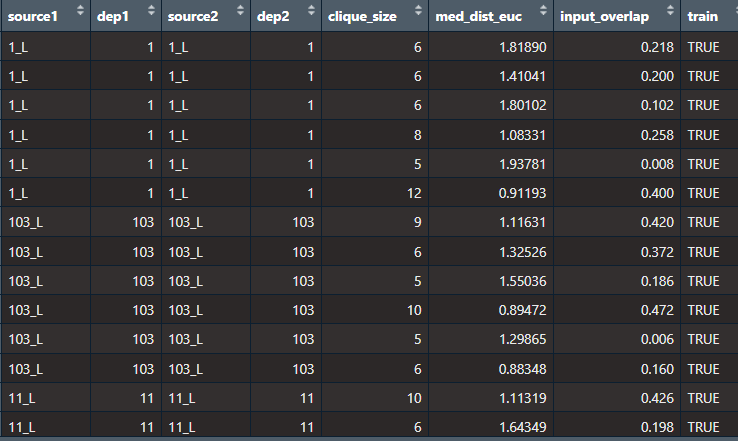

```{r, include = FALSE}
knitr::opts_chunk$set(
  collapse = TRUE,
  comment = "#>"
)
```

# Introduction

## Abstract
Score-based likelihood ratios (SLRs) are a statistical method used to quantify the weight of evidence and have been used in many forensic disciplines. Using the context of footwear evidence to make the problem more concrete, similarity/dissimilarity scores are computed from pairs of shoeprints. Therefore, there is a dependence between scores that share a shoeprint or shoe in common. Given up to 5 similarity/dissimilarity scores, we include four different methods of computing the SLR that address the dependence. We also provide a visualization of the resulting SLR using a ROC curve. More information can be found on the corresponding [Github repository](https://github.com/valeriehan6/scoreLR).

## SLRs
Score-based likelihood ratios (SLRs) are used to determine the strength of evidence for a particular source proposition. Typically, they aim to quantify the similarity between an item found at a crime scene and a reference item with a known origin. The score measures the degree of similarity by analyzing one or more features of the items being compared. To assess the probative value of the evidence, examiners estimate the distributions of the score under two competing propositions using experimental pairs of items with a known origin. However, using items from the same source to build these distributions can result in score dependence. This dependence can affect the accuracy of the SLR as a classifier. To address this issue, researchers have used kernel density estimation and explored methods to improve the performance of the SLR. The performance is measured based on accuracy, true positive rate, true negative rate, and the rate of weak or misleading evidence. One method has shown significantly better performance in three out of four performance criteria compared to default methods.

## Using SLR with Footwear Evidence
Take the following hypothetical scenario. Shoeprints are discovered and crime scene investigators obtain images of those prints. Additionally, high-quality impressions of a suspect's shoe outsole are available to the forensic scientist. The question of interest is whether the suspect's shoe could have produced the prints at the crime scene.
To answer this question, we can rephrase the problem as a test of two propositions:
Hp: The shoeprints at the crime scene were made by the suspect's shoe.
Hd: The shoeprints at the crime scene were made by someone else's shoe.

## Methods
 Given scores $s_1 .. s_k$ where each $s_i$ is computed from a pair of shoeprints, the SLR is defined as 
 
  $$ SLR = \frac {f(s_1, . . . , s_k|H_p)} {f(s_1, . . . , s_k|H_d)}$$ where $f(s_1, . . . , s_k|H_p)$ and $f(s_1, . . . , s_k|H_d)$ are estimated densities for the scores $s_1 .. s_k$ under the two different hypotheses. Since the scores, do not obviously follow any known distribution, kernel density estimation (KDE) is used to estimate the KM and KNM distributions. However, KDE assumes that the scores are independent.  Scores computed from pairs of images are not independent because images of the same shoe appear in multiple pairs. For details about the data refer to the data section. There are four proposed methods to deal with this dependence issue. The first method is to ignore the fact that the observations cannot be assumed to be independent and implement KDE using all available scores. This method is labeled ignore_dep. Another is to remove the dependence in the dataset that is used to estimate a KDE and to reduce the sample to the largest independent subset of pairs. We call this the strict_indep_set.  In the third approach, we create multiple random independent subsets of the training dataset and implement KDE in each subset. This method is called multiple_kde. In the last method, we average over the scans that correspond to the same pair of shoes. Here the actual pairs of shoes included in the dataset are independent. This is called average_features. 


# The Data 

This package includes a dataset called shoe_data.csv. We use a large set of footwear outsole images created by the Center for Statistics and Applications in Forensic Evidence (CSAFE). One hundred and forty-seven pairs of worn shoes, each scanned four times, are included in the dataset. Note each row is a piece of evidence. 


The data in this package is a data frame with 926 rows and 7 variables: 

* source1: shoe identifier for the first shoe, left (L) or right (R)
* dep1: pair identifier for the first shoe
* source2: shoe identifier for the second shoe, left (L) or right (R)
* dep2: pair identifier for the second shoe
* clique_size: score; size of the maximal clique
* med_dist_euc: score; median Euclidean distance between overlapping pixels
* input_overlap: score; proportion of overlapping pixels in the aligned images


## Inputting New Data:
You can choose to import your own dataset, but it must be of an identical format with the same variable names. 

Your data should include:

* source1:  identifier for the first item
* dep1: pair identifier for the first item
* source2:  identifier for the second item
* dep2: pair identifier for the second item
* You can include up to five columns of scores where each column represents a different "function" (like euclidean, basic difference, deviation, etc). These do not have to be named something specific. 

If sources match then that row will be labeled as a known match and if sources do not match it will be labeled as a known-non match. 

# Functions


This package has seven main functions and three helper functions. 

### dep_split 

This function creates a train/test split for datasets with dependencies. The resulting data will be in the form of a dataframe with an added column for known match(KM) and known non match. You can specify the train/test split percentage: p - 100*p. Note p is between 0 and 1. 


### slr_results
This function is essentially a wrapper function that compares the results of the various methods. 

### plot_slr_roc
This function plots the ROC curve for each method. The ROC curve is created by plotting the true positive rate against the false positive rate at various threshold settings.

## Methods Functions

### 1. ignore_dep
This function returns a slr evaluation for the ignore dependence method. This method, like the name suggests, ignores that multivariate observations cannot be assumed to be independent, and implements kernel density estimation using all available scores.


### 2. strict_indep_set
This function returns a slr evaluation for the strict independence set. To use this method, we construct an independent subset of the observations where each item only appears in one pair. The resulting dataset is much smaller than the original sample.

### 3. avg_features
This function returns a slr evaluation for the average features method. This method averages over the scans that correspond to the same pairs. This results in an independent set of multivariate scores. 


### 4. multiple_kde
This function returns a slr evaluation for the multiple kde method. This method creates multiple random independent subsets of the training dataset and implements KDE in each subset. 

## Helper Functions 

### opt_thresh
This function returns a threshold for the SLR. 

### indep_km_set
This function returns an independent KM set of the training data using `seed`. 

### indep_knm_set
This function returns an independent KNM set of the data using `seed` given KNM_train.

### plot_slr_roc
This function plots the ROC curve of each method individually.


# Installation

You can install the development version of scoreLR like so:

```{r, eval=FALSE}
devtools::install_github("https://github.com/valeriehan6/scoreLR")
```


# Load Library
```{r, eval=FALSE}
library(scoreLR)
```


# Using scoreLR


There are a couple of ways to use this package. 

You can:
* Use all methods to get multiple slr values
* Plot ROC 
* Compare methods


## Example

First read in your data. Note your data must follow the specifications outlined in the data section. 
```{r, eval=FALSE}
exdata <- readr::read_csv("./data/shoe_data.csv")
```


Then you can use the dep_split function to separate your data into training and testing data. 
```{r, eval=F}
exdata_split <- dep_split(exdata, 0.8, 20230413)
data <- exdata_split

KM_train <- data %>% filter(source1 == source2 & train == TRUE) # split based on indicator column
KM_test <- data %>% filter(source1 == source2 & train == FALSE) # split based on indicator column
# Filter data to rows where source1 != source2
KNM_train <- data %>% filter(source1 != source2 & train == TRUE)
KNM_test <- data %>% filter(source1 != source2 & train == FALSE)

```


This output will give you two dataframes, one for your train data and one for your test data:




Then you can calculate SLRs based on three methods. 
```{r, eval=FALSE}

ignore_dep(KM_train, KM_test, KNM_train, KNM_test)
avg_features(KM_train, KM_test, KNM_train, KNM_test)
```


You can compare the results using the slr_results function. 
```{r, eval=FALSE}
slr_results(data)

```


The last thing you can do is plot the ROC curves. 
```{r, eval=FALSE}
plot_slr_roc(data, method = "AverageFeatures")
```

